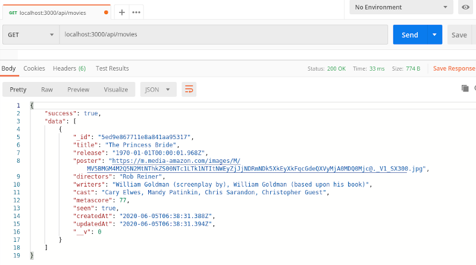

# movie-diary

a MERN application to keep track of movies you've seen and want to see.
I am building this application as a tutorial, which I will live-code on my [twitch channel](https://www.twitch.tv/kevindejesusjones).

This will be a full-stack MERN application, using Mongo, Express, React, and Node, and will also pull information from the [Open Movie Database API](https://www.omdbapi.com/).

## Prerequisites

In order to build this application, we will need the following already installed:

- Node
- NPM
- Nodemon (I have it installed globally; can be installed as a dev dependency on a per-project basis)
- MongoDB
- Mongoose CLI
- Postman

## Let's Get Started!

Open a terminal window, make a new directory called movie-diary', and `cd` into it.

```
mkdir movie-diary && cd movie-diary
```

You are now at your application's 'root' level. If you type the command `pwd` into your terminal, you will see something like:

```
~/movie-diary
```

I will refer to this location as 'the app's root directory' from here on out.

If you plan on saving this project on github/gitlab/any other git-based version control repo, enter the following commands now:

```
echo "mern-movies" >> README.md
echo "node_modules/" >> .gitignore
```

The first command will create a readme file, and the second will ensure that you don't upload all of your npm packages.

## Spin up an Express Server

In the app's root directory, run the following command:

```
npx express-generator --no-view
```

If you have anything already in the directory (like a readme), you will have to confirm that you want to run the generator (y/n). Select 'y'.
After the generator has run, enter this npm command in your terminal to install dependencies:

```
npm install
```

Add a couple more dependencies:

```
npm install axios mongoose concurrently if-env dotenv --save
```

In `bin/www`, change the following line:

```
var port = normalizePort(process.env.PORT || '3000');
```

To make the port `3001` instead. This will help us later when we add our React application.

```
var port = normalizePort(process.env.PORT || '3001');
```

And then run the application by entering this command into your terminal to make sure everything installed properly:

```
DEBUG=movie-diary:* npm start
```

Now, if you open a browser window and enter 'http://localhost:3001' into the url bar, you should see the following:


In your terminal window, type Ctrl+C to shut down the server.

### What did we just do?

`NPX` comes bundled with NPM, but unlike NPM, it downloads _and_ runs the package.
Express-Generator is an executable NPM package that generates a boilerplate express server for you. At this stage, all it does is create a server that runs on localhost:3001, and serves a success message. Later on we will add some things to our server, like the connection to our mongo database.
--no-view: Express-generator has built-in functionality to add templating engines to your server, like EJS, Handlebars, or Pug (among others). We won't be needing a templating engine since we are going to use React, so the --no-view flag lets express generator know that it can do a little less.

Before moving on to the database, let's make some changes to `package.json` to specify our app's main entry point, and a "watch" script:

```
"main": "./bin/www",
"scripts": {
  "start": "node ./bin/www",
  "watch": "nodemon ./bin/www"
}
```

This will allow you to run the server using nodemon by entering `npm run watch` into the terminal. Nodemon will listen for changes saved to the server, so you don't have to kill & re-run it every time you need to make a change.

## Generate Database and Models

We're going to use `Mongoose-cli` to generate our database models. You can read all about Mongoose-cli [here](https://github.com/codesmith-admin/mongoose-model-cli).

If you don't have it installed, do so via npm (here we are doing it globally):

```
npm install -g mongoose-model-cli
mongoose help
```

These two commands will install mongoose-cli globally and show successful installation.

We can then generate a `movie` model, with fields for information we will get from the Open Movie Database.

```
mongoose generate model movie title:string release:date poster:string directors:string writers:string cast:string metascore:number seen:boolean
```

Let's look at the new files and folders we have in our directory:

```
movie-diary/
  models/
    migrations/
    seed/
    all-models.js
    connection-string.js
    Movie.js
```

Mongoose-cli has generated our 'Movie' model, along with some helper files to connect it to your application.

Mongoose has a built-in feature that will update `connection-string.js` with your MongoDB Connection URI.
First let's open `connection-string.js`, and note that it sets a variable as an empty string:

```
var uri = '';
```

Then, in the terminal, we can run:

```
mongoose setUri <uri>
```

And it will change the value of that variable in `connection-string.js` to the value you input in \<uri\>.

Note that if you need to set the connection uri to be variable, like if you are planning on deploying this application on heroku or elsewhere, you should just edit this string directly, for example:

```
var uri = process.env.MONGODB_URI || <uri>;
```

Let's use `seed/seedfile.js` to give our database an entry for us to work with. Again, mongoose-cli has made this very clear for us with comments telling us where and how to input our data. Following their example and removing the comments, we'll end up with a file that looks like this:

```
var mongoose = require('mongoose');

require('../all-models').toContext(global);

Movie.create([
   {
     title: 'The Princess Bride',
     release: new Date('1987-10-09'),
     poster: 'https://m.media-amazon.com/images/M/MV5BMGM4M2Q5N2MtNThkZS00NTc1LTk1NTItNWEyZjJjNDRmNDk5XkEyXkFqcGdeQXVyMjA0MDQ0Mjc@._V1_SX300.jpg',
     directors: 'Rob Reiner',
     writers: 'William Goldman (screenplay by), William Goldman (based upon his book)',
     cast: 'Cary Elwes, Mandy Patinkin, Chris Sarandon, Christopher Guest',
     metascore: 77,
     seen: true
   }
 ])

 .then(() => {
   console.log("Seed complete!")
   mongoose.connection.close();
 });

```

Now we can insert this data into our database by running the seedfile with node.
`node models/seed/seedfile.js`
Or, we could add a script to `package.json`, and then run it with npm.

```
"scripts": {
  "seed": "node models/seed/seedfile.js"
}
```

```
npm run seed
```

To make sure it worked, you can run mongo in your terminal and enter the following:

```
use <database name>
db.movies.find()
```

And you should see the result you seeded. Now let's:

- connect this database to our server
- build a controller to manipulate our data
- add some api routes so that we can do that via the browser
- test it all with postman.

## Connect Database to the Server:

In `app.js`, let's make a few changes.

```
var express = require('express');
var path = require('path');
var cookieParser = require('cookie-parser');
var logger = require('morgan');

// add this line:
var mongoose = require('mongoose');

/*
* change these routers. Currently they should look like this:
*/
var indexRouter = require('./routes/index');
var usersRouter = require('./routes/users');

// let's delete those and instead say:
var apiRouter = require('./routes/apiRoutes');
/*
* We will need to make more changes below in order for this to work properly.
*/

var app = express();

app.use(logger('dev'));
app.use(express.json());
app.use(express.urlencoded({ extended: false }));
app.use(cookieParser());
app.use(express.static(path.join(__dirname, 'public')));

// Add this if you plan to deploy:
if (process.env.NODE_ENV === "production") {
  app.use(express.static('client/build'));
}

/*
* As we did above, let's also change these so that it instead points to the apiRoutes.js file that we will create. Currently it looks like this:
*/
app.use('/', indexRouter);
app.use('/users', usersRouter);

// change it to look like this:
app.use('/api', apiRouter);

/*
* And then add this line to get the server ready for React:
*/
app.get("*", function(req, res) {
  res.sendFile(path.join(__dirname, './client/build/index.html'));
});

/*
* And finally, a few lines to make the mongoDB connection:
*/
mongoose.connect(process.env.MONGODB_URI || 'mongodb://localhost/movieDiary', {
  useNewUrlParser: true,
  useFindAndModify: false,
  useUnifiedTopology: true
});

mongoose.connection.on('error', console.error.bind(console, 'MongoDB connection error:'));

module.exports = app;
```

If you don't plan on deploying, your `mongoose.connect` be simplified to this:

```
mongoose.connect('mongodb://localhost/movieDiary', {
  useNewUrlParser: true,
  useFindAndModify: false,
  useUnifiedTopology: true
});
```

## Database Controllers & API Routes

In keeping with the changes to the routers that we just made above, let's delete `routes/users.js` and rename `routes/index.js` to `routes/apiRoutes.js`. In the terminal, at root directory:

```
rm routes/users.js && mv routes/index.js routes/apiRoutes.js
```

We're going to add a bunch of routes to `apiRoutes.js` that will allow us to perform CRUD (create, read, update, delete) functions on the database. First, though, we are going to build a controller that the router will use to perform these functions. So, in the terminal, at root directory, let's make our controller.

```
mkdir models/controllers && touch models/controllers/movieController.js
```

`movieController` will contain the following. I have put the functions in CRUD order.

```
const Movie = require('../models/Movie');

module.exports = {
  // ======== CREATE ========
  addMovie: (req, res) => {
    const body = req.body;
    if (!body) {
      return res.status(400).json({ success: false, error: 'No movie provided' });
    }
    const movie = new Movie(body);
    if (!movie) {
      return res.status(400).json({ success: false, error: err });
    }
    movie.save()
      .then((result) => {
        return res.status(201).json({
          success: true,
          id: movie._id,
          message: 'Successfully added movie'
        })
      })
      .catch(err => {
        return res.status(400).json({
          err,
          message: 'Failed to add movie'
        });
      });
  },
  // ======== READ: ========
  findAll: async (req, res) => {
    await Movie.find({}).sort({ createdAt: 1 }).exec((err, movies) => {
      if (err) {
        return res.status(400).json({ success: false, error: err });
      }
      if (!movies.length) {
        return res.status(400).json({ success: false, error: err });
      }
      return res.status(200).json({ success: true, data: movies });
    });
  },

  findById: async (req, res) => {
    await Movie.findOne({ _id: req.params.id }, (err, movie) => {
      if (err) {
        return res.status(400).json({ success: false, error: err });
      }
      if (!movie) {
        return res.status(404).json({ success: false, error: 'Movie not found' });
      }
      return res.status(200).json({ success: true, data: movie });
    })
      .catch(err => console.log(err));
  },
  // ======== UPDATE: ========
  updateMovie: async (req, res) => {
    const body = req.body
    if (!body) {
      return res.status(400).json({ success: false, error: "You must provide a movie to update" });
    }
    await Movie.findOneAndUpdate(
      { _id: body._id },
      {
        seen: body.seen,
        updatedAt: Date.now()
      },
      // passing { new: true } assures that the function will return
      // the NEW document and not the old one.
      { new: true }
    )
      .then(update => {
        return res.json({ success: true, post: update });
      });
  },
  // ======== DELETE ========
  deleteById: async (req, res) => {
    await Movie.findByIdAndDelete(
      { _id: req.params.id },
    )
      .then(result => res.json({ success: true, deleted: result.title }));
  }
}
```

Now that we've got our controller, let's build out our API routes to use them in order to create, read, update, and delete database entries.

In `routes/apiRoutes.js`, let's just add a couple and then test them to make sure they're working:

```
var express = require('express');
var router = express.Router();
const movieController = require('../models/controllers/movieController');

/* root directory: /api/ */

// ======== READ ========
router.get('/movies', movieController.findAll);
router.get('/movies/:id', movieController.findById);

module.exports = router;
```

Now if we run our server (`npm run watch` in the terminal), we can use postman to make sure these two simple get routes work.


Assuming we don't encounter any errors, we can go ahead and add the rest of our routes.

```
// ======== CREATE ========
router.post('movies/new', movieController.addMovie);

// ======== READ ========
router.get('/movies', movieController.findAll);
router.get('/movies/:id', movieController.findById);

// ======== UPDATE ========
router.put('/movies/update', movieController.updateMovie);

// ======== DELETE ========
router.put('/movies/delete/:id', movieController.deleteById);
```

Try using postman to add another entry, retrieve an entry by ID or all entries, edit whether it's been 'seen', and delete it.

## OMDB Search Route

Many external API's, including open movie database, require a unique key in order to use their services. This allows the service to limit the amount of data that one user can request through their servers, since data transfers come with a cost. When creating an application, you need a way to use your unique key without keeping it anywhere the user can access it, because if someone gets a hold of your key, they can exhaust your limits, or run up a huge bill for you if you're using a paid API service. This means we'll need to use environment variables to store your api key at the backend.

Add the following line to `app.js` (I put it in the very first line):

```
require('dotenv').config();
```

Next, you'll need to register for an api key on (omdbapi.com)[https://www.omdbapi.com].

Once you have your key, create a new file at your app's root directory called `.env`.

```
touch .env
```

Add this file to .gitignore - _very important._

.gitignore should now look like this:

```
node_modules/
.env
```

Open `.env` and add the following:

```
OMDB_KEY=[your unique key]
```

This will create a variable called `OMDB_KEY`, which you can access anywhere on your backend by entering `process.env.OMDB_KEY`.

Now let's build the route to search the open movie database using your unique key.

At your app's route directory, enter the following command to make a new `routes` file:

```
touch routes/searchRoutes.js
```

In `app.js`, add the following line right before `var apiRouter = require('./routes/apiRoutes');`

```
var searchRouter = require('./routes/searchRoutes')
```

And, in `app.js`, add the following line right before `app.use('/api', apiRouter);`:

```
app.use('/search', searchRouter);
```

Now, to make sure our environment variables are working, open `searchRoutes.js` and insert the following:

```
const express = require('express');
const router = express.Router();

router.get('/', (req, res) => {
  res.json({ success: true, omdbKey: process.env.OMDB_KEY });
});

module.exports = router;
```

Now, if your server is running, if you make a get request via postman (or just enter `localhost:3001/search` into your browser's url bar), you should see your api key returned.

Of course, we don't want to return your api key to the user, so let's change that route to the following. Note that we are changing the `get` route to a `put` route:

```
const express = require('express');
const router = express.Router();
const axios = require('axios');

router.put('/', (req, res) => {
  const { url, search } = req.body;
  axios.get(url + process.env.OMDB_KEY + search)
    .then(result => {
      res.json(result.data);
    })
    .catch(err => console.log(err));
});

module.exports = router;
```

Test this route in postman by sending a `put` request to `localhost:3001/search`, with the following request body:

```
{
  "url": "https://www.omdbapi.com/?apikey=",
  "search": "&t=the+princess+bride"
}
```

You should get back some data related to the movie "The Princess Bride".

### What did we just do?

We just played a little data ping-pong with ourselves and the open movie database. Because we don't want to reveal our secret api key, we had to make the api call to the open movie database from the backend. So we made a special route on our backend that:

1. Builds a string, which is a url including our secret api key and our search parameters
2. Uses the axios package to send that request to the omdb api
3. Receives the data back from the database, extracts the relevant chunk of data, and:
4. Will return it to our front-end.
   So, front-end to our back-end to omdb to our back-end to our front-end.

This completes our backend, so now it's time to get into some React!

## Create a React App

In the terminal, at the app's root directory, enter the following command:

```
npx create-react-app client
```

This will take a minute or two to complete, but will create a react application called 'client'.

As advised in the terminal window, you can test some of these pre-built react scripts by moving into the `client` directory with `cd` and running `npm start`. This will open a new browser window and you'll see the spinning react logo.

Inside of `client`, you'll notice we have another `package.json` file that react built for us. Let's make one change to this file. Right after `"private": true,` and before `"dependencies": {`, let's add a proxy:

```
"proxy": "http://localhost:3001",
```

This will help us to run our server and the react application at the same time, so we don't have to run two servers in two separate terminal windows.

Back in the original (root-level) `package.json`, we have a bunch more scripts to add. When we're done the scripts object will look like this:

```
"scripts": {
  "start": "if-env NODE_ENV=production && npm run start:prod || npm run start:dev",
  "start:prod": "node ./bin/www",
  "start:dev": "concurrently \"nodemon --ignore 'client/*'\" \"npm run client\"",
  "client": "cd client && npm run start",
  "install": "cd client && npm install",
  "build": "cd client && npm run build",
  "heroku-postbuild": "npm run build",
  "watch": "nodemon ./bin/www",
  "seed": "node ./models/seed/seedfile.js"
}
```

Now if we run `npm run start:dev` in the terminal, we will get the local, development version of our application. Both react and nodemon will reset the application when we make changes, so we still won't have to kill and re-run our server in order to save changes we make.

Let's clean up some of the react files we won't need:

```
cd client/src
rm App.test.js logo.svg serviceWorker.js setupTests.js
```

Inside of `client/src/index.js`, delete the lines relevant to the serviceworker so that the file looks like this:

```
import React from 'react';
import ReactDOM from 'react-dom';
import './index.css';
import App from './App';

ReactDOM.render(
  <React.StrictMode>
    <App />
  </React.StrictMode>,
  document.getElementById('root')
);

```

## Front-End API Util

Similar to our movieController on the back end, let's make a javascript file that exports a list of CRUD functions, so that our front-end can make requests on the API/Database. In a terminal at the app's root directory:

```
mkdir client/src/utils
cd client/src/utils && touch API.js
```

Let's open our new file API.js and add the following:

```
import axios from 'axios';

export default {
  // save a new movie (create):
  saveMovie: (movie) => {
    return axios.post('/api/movies/new', movie);
  },
  // get all movies (read):
  getMovies: () => {
    return axios.get('/api/movies');
  },
  // get movie by id:
  getMovieById: (id) => {
    return axios.get('/api/movies/' + id);
  },
  // update movie (update):
  updateMovie: (movie) => {
    return axios.put('/api/movies/update', movie);
  },
  // delete movie (delete):
  deleteMovie: (id) => {
    return axios.delete('/api/movies/delete/' + id);
  },
  // search for new movies on omdb:
  omdbSearch: (body) => {
    return axios.put('/search', body);
  }
}
```

## Building React Components

`App.js` is the 'main' file of our application, and it will call all of our other components. A component will render whatever JSX is inside the `return`. Test this out by deleting all of the default content within the `return` statement, and placing a single `<h1>` tag inside. When you run `npm start:dev`, you should see your h1 tag rendered in the browser.

```
import React from 'react';
import './App.css';

function App() {
  return (
    <h1>Hello, React!</h1>
  );
}

export default App;

```

It's important to note that the function can only return a single JSX element. If you need more than one element, like a h1 tag and a p tag, for instance, you have to wrap them inside of a single component, like a div.

```
<div>
  <h1>Hello, React!</h1>
  <p>More components on the way</p>
</div>
```

Let's take a quick step back and make sure our API util works properly. Edit the `App.js` component to the following:

```
import React, { useEffect } from 'react';
import API from './utils/API';

const App = () => {

  useEffect(() => {
    API.getMovies()
    .then(res => console.log(res.data));
  })

  return (
    <div>
      <h1>Check the console ---></h1>
    </div>
  )
}

export default App;
```

There's a bit to unpack here. `useEffect` is a 'hook' built into react that we will use to tell our application when to fetch data from our API. Upon loading the application, the App component calls the API util to fetch all of our movies from our database, and then logs them to the console. Assuming you don't get any errors, this shows that the API util is hooked up properly.

Now we can start building our other components. There are several ways to do this, but I prefer each component to be a subdirectory which contains the jsx file (index.js) and the css for that file. This allows us to write css with regular syntax, instead of having to change it to make it jsx-compatible.

Let's make our first component, which will be a list item that will display the information for a single movie. In a terminal window at the app's root directory:

```
mkdir client/src/components
mkdir client/src/components/MovieListItem
cd client/src/components/MovieListItem && touch index.js style.css
```

Now, inside `client/src/components/MovieListItem/index.js`:

```
import React from "react";

const MovieListItem = (props) => {
  return (
    <div>
      <h3>{props.title}</h3>
      
      <p>Directed By: {props.directors}</p>
      <p>Starring: {props.cast}</p>
      <p>Written By: {props.writers}</p>
    </div>
  );
};

export default MovieListItem;

```

This will create an element that takes in all of the movie data as props, and renders them as a re-usable div. We can generate as many as there are movies in our database.
